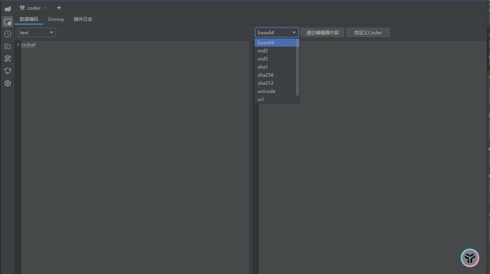
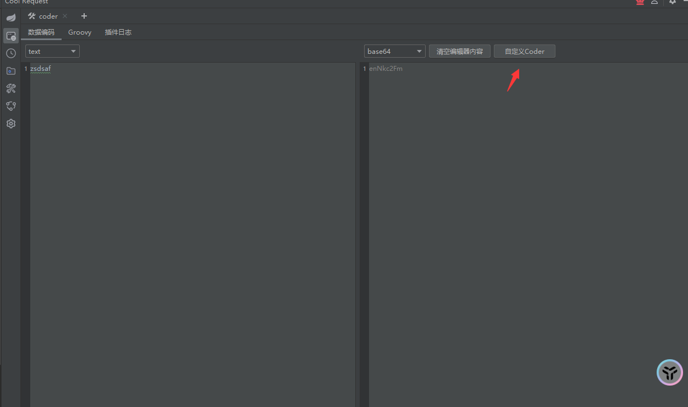
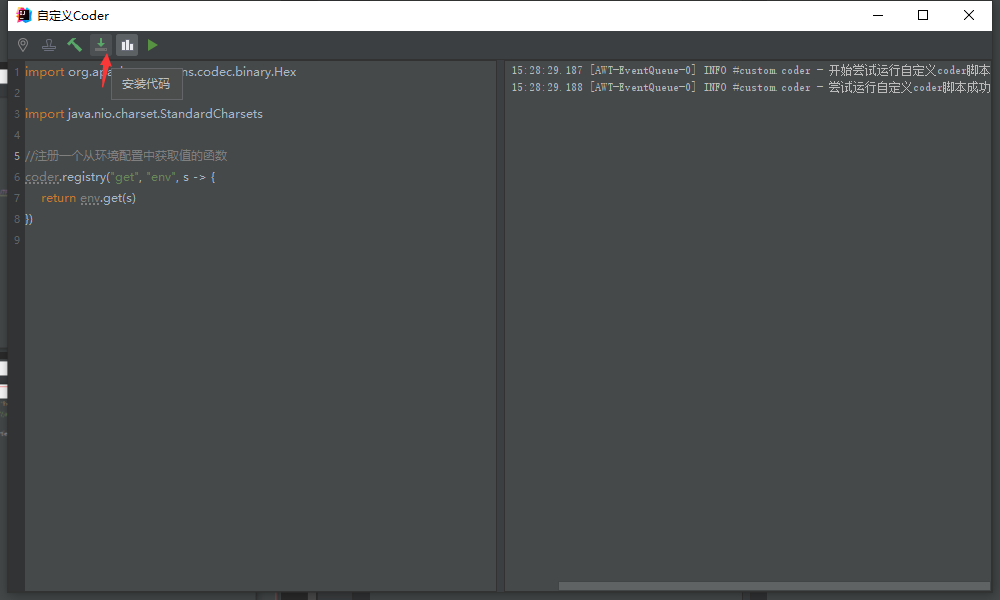
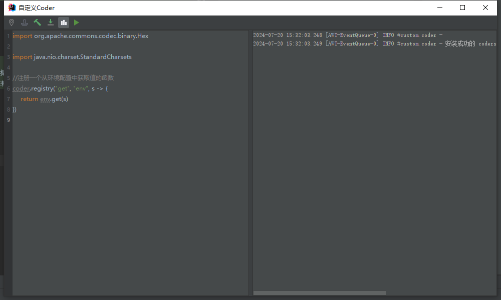
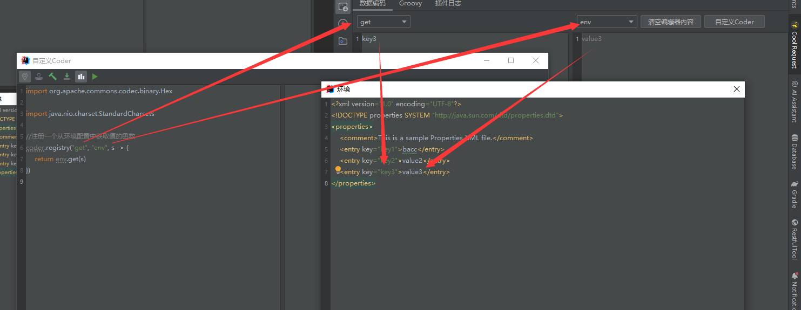
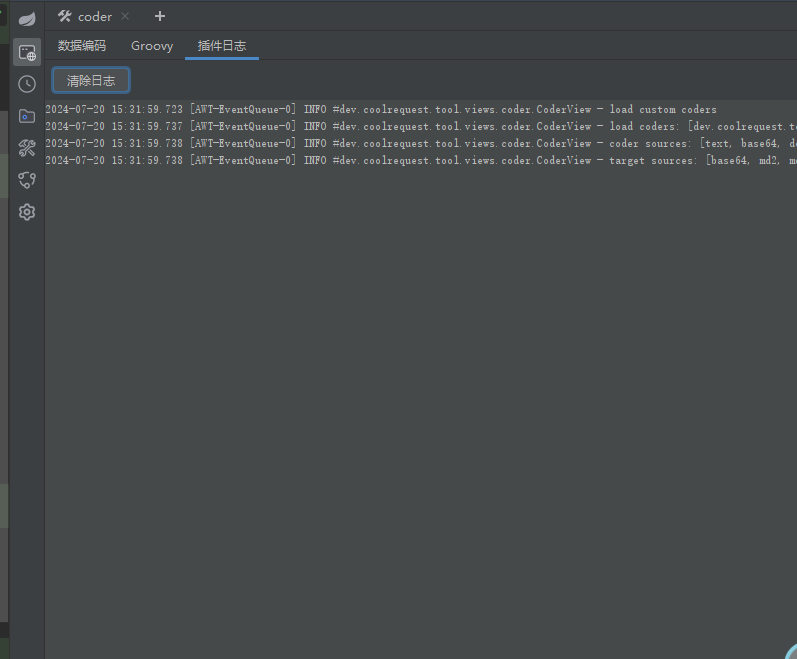

# Coder插件
`属于Cool Request插件中的一个插件`
# 功能介绍
##  1. 数据转换
```markdown
支持将text转换成md5,base64,sha等等
支持将base64转换成binary,text等
支持将dec转换成binary,hex
```

## 2. 自定义数据转换
```markdown
1. 支持通过groovy脚本自定义数据转换
2. 支持多种文件格式的环境变量,可在数据转换中使用
3. 添加代码模板,编译,安装,使用项目依赖,运行功能,用于调试自定义的数据转换功能
```



`测试`




## 3. Groovy脚本
```markdown
1. 可添加classpath,支持目录,jar包,zip包,多条可通过,或者换行符分割
2. 模板代码,使用项目依赖
3. 运行,清除日志
```

## 4. 插件日志
```markdown
1. 可用于自定义数据转换函数安装成功之后,可在函数中使用sysLog向插件日志面板输出日志
2. 可用于Groovy脚本调试向插件日志面板输入日志
```


